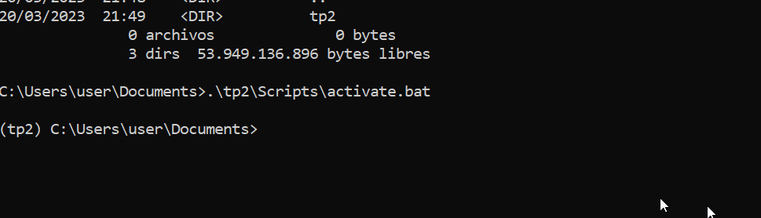

# Unidad 02
# - Python
# - pip
# - virtualenv
# <!-- Presentación-->
---
# pip

## Acrónimo **P**ackage **I**nstaller for **P**ython


---

# pip list

```
$ pip list
```


---

# Actualizar pip
```
$ python -m pip install --upgrade pip 
```


---
# Instalar virtualenv

```
pip install virtualenv
```


---
```
pip list

```


---

# Entornos virtuales

* ## Python biblioteca estándar (Módulos)
* ## Es muy común usar módulos de terceros

Un entorno  aislado de ejecución que permite a los usuarios de Python y a las aplicaciones instalar y actualizar paquetes de distribución de Python sin interferir con el comportamiento de otras aplicaciones de Python en el mismo sistema.

---

# Crear un entorno virtual
```
$ virtualenv [dirname]
```


---
# Activar el entorno virtual
```
.\tp2\Scripts\activate.bat
```

```
$ pip list
```
---
# Freeze
Para guardar todos los requerimientos de una aplicación 
```
$ pip freeze > requirements.txt
```

Luego para restituirlos en un entorno virtual diferente en otro equipo o directorio.

```
$ pip install -r requirements.txt
```

---
Trabajo Practico 2

La facultad tiene una estación meteorológica funcionando en el techo del edificio.

[Link Galileo Galilei](https://www.frcon.utn.edu.ar/galileo/mb3.htm "Estación meteorológica")

La estación actualiza información aproximadamente cada 5 minutos. La siguiente [url](https://www.frcon.utn.edu.ar/galileo/downld02.txt) presenta datos de los últimos días en forma de registros, en un archivo de texto plano.
Utilizando la biblioteca o el paquete **requests**, escribir un programa en python que muestre por consola el dia, la hora y la temperatura del ultimo registro.

